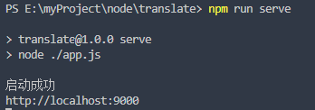
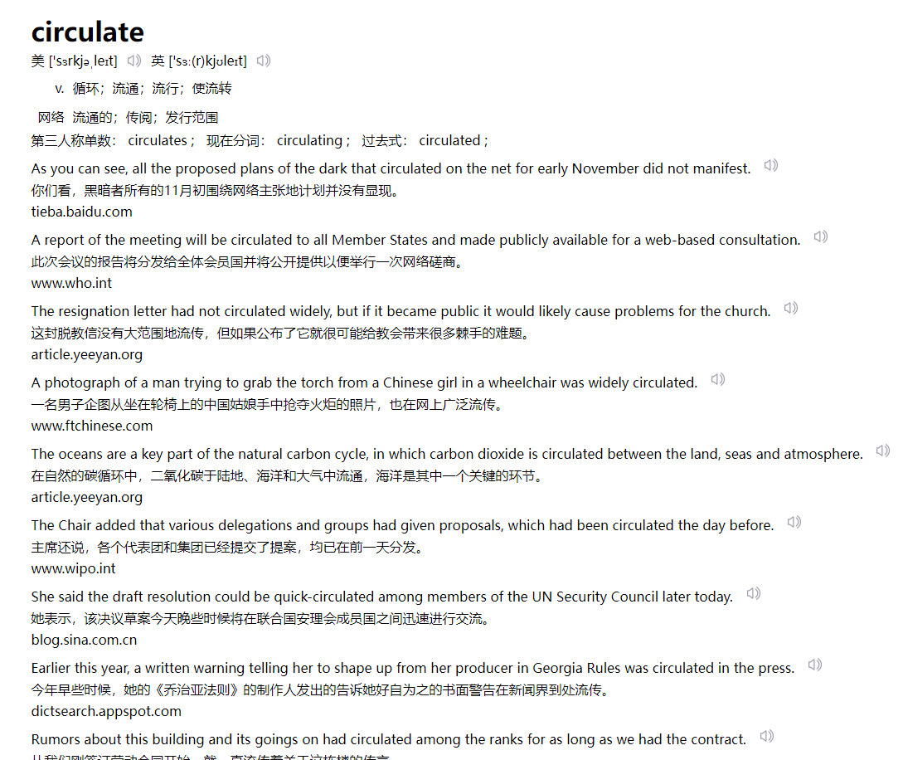
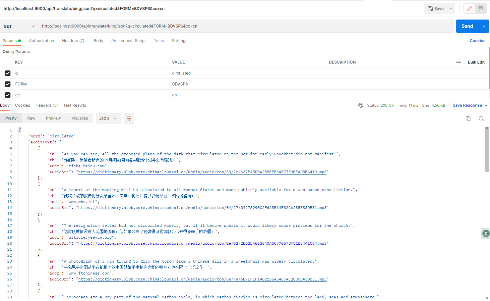

# 一个由koa+xmldom+xpath实现的建议爬虫有道翻译词典服务

使用前需要安装 `node v12.0.0+` ,然后clone本仓库启动即可。

1. clone 到本地

   ```shell
   git clone https://github.com/plas007/koa-translate.git
   ```
2. 安装依赖

   ```shell
   npm install
   ```
3. 启动服务

   ```shell
   npm run serve
   ```
4. 启动成功后如下图：

   
5. 在浏览器访问:

   ```shell
   http://localhost:9000/api/translate/bing/html?q=circulated&FORM=BDVSP6&cc=cn
   ```
   
6. 在接口调用JSON:

   ```shell
   http://localhost:9000/api/translate/bing/json?q=circulated&FORM=BDVSP6&cc=cn
   ```
   
